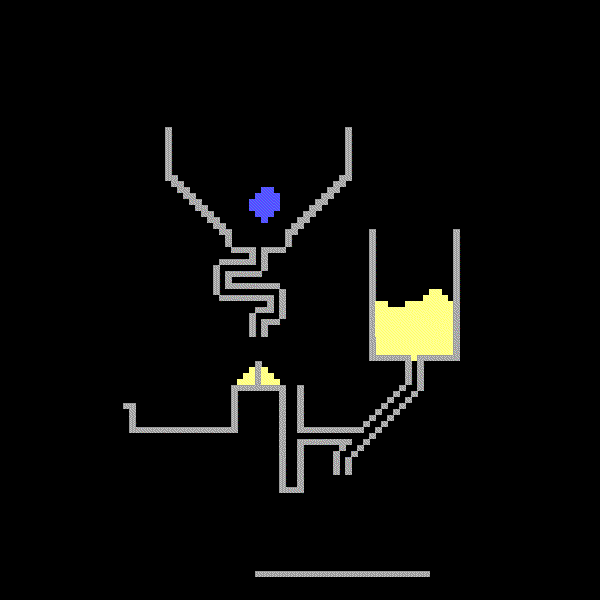
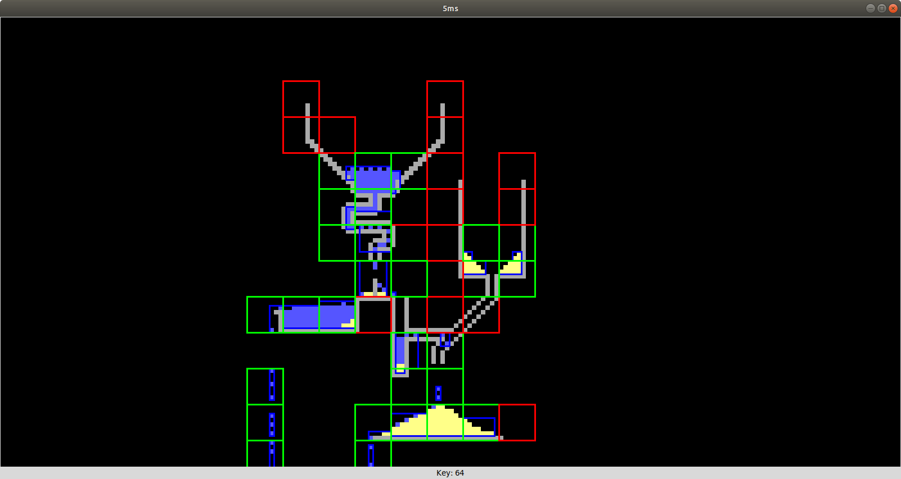

# Sand-sim
A simple pixel based simulation in python.

The world is stored in a sparse, chunk based (red and green squares), data structure and updated only in needed sub sections (blue rectangles).

A simulation can be stored in a compressed binary format and reloaded later.
